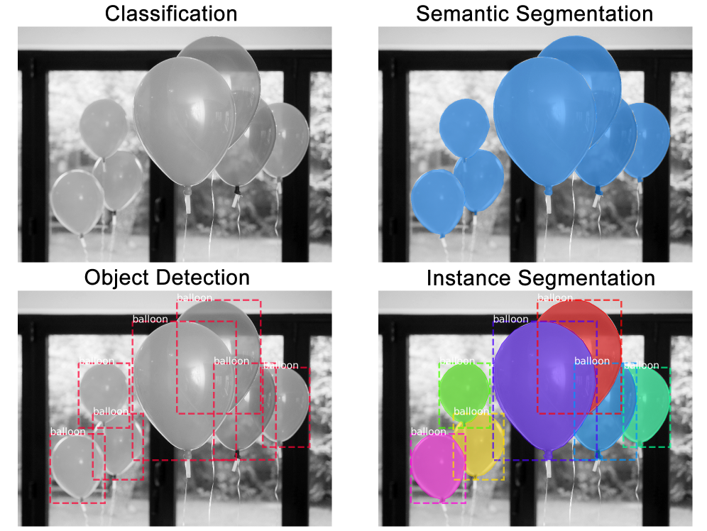

# Introducción

La segmentación de instancias en imágenes es uno de los problemas más importantes en *Computer Vision*.

# Primeros pasos

**Definición.-** La *segmentación de instancias* en una imagen consiste en, para cada objeto dentro de una imagen, detectarlo y delimitar la zona de la imagen que ocupa.

Existen diferentes modelos de *CNNs* que son capaces de obtener muy buenos resultados tanto en detección de objetos como en segmentación de imágenes, como *Fast/Faster R-CNN*. Es más complicado hacer la segmentación de instancias, pues requiere que nuestra red neuronal realice con precisión ambas tareas anteriores.

## Mask R-CNN

El modelo que estudiaremos es conocido como **Mask R-CNN**, y lo que pretende es extender *Faster R-CNN* añadiendo capas a este para predecir las máscaras de segmentación de cada una de las regiones de interés (*RoI*) de la imagen, a la vez que trata de dar *bounding boxes* y clasificación a los objetos de la imagen.

Sabemos que *Faster R-CNN* da, para cada candidato de objeto, dos salidas:

- Una etiqueta de clasificación
- Un *bounding* box

Con *Mask R-CNN* se le añade una nueva salida que es la máscara de segmentación del objeto.

**Faster R-CNN** tiene dos etapas: una primera en la que se dan propuestas de *bounding boxes* para los objetos, y la segunda (que es en sencia *Fast-RCNN*), extrae características usándo **RoIPooling** por cada propuesta que ha obtenido y luego realiza clasificación y regresión sobre las *bounding-box*.

**Mask R-CNN** tiene las dos mismas etapas, con la diferencia que en la segunda, en *paralelo* a predecir la clase y la *bounding-box*, también aporta una máscara de segmentación para cada *RoI*.

Duranete el entrenamiento, se define una **función de pérdida** con múltiples factores por cada *RoI*, tenemos la función:
$$
L = L_{cls} + L_{box} + L_{mask}
$$

En *Faster-RCNN* teníamos sumando la función de pérdida de la clasificación ($L_{cls}$) y la de la *bounding-box* ($L_{box}$). Ahora, añadimos un sumando a la función, la función de pérdida de la máscara de segmentación de cada objeto ($L_{mask}$).

Es importante denotar que gracias a $L_{mask}$, las máscaras y las predicciones de clases están desacopladas, al contrario que cuando se aplican *FCN* para segmentación semántica. Este desacople ayuda mucho a una buena segmentación de instancias.
## El modelo de CNN

## Subsection
